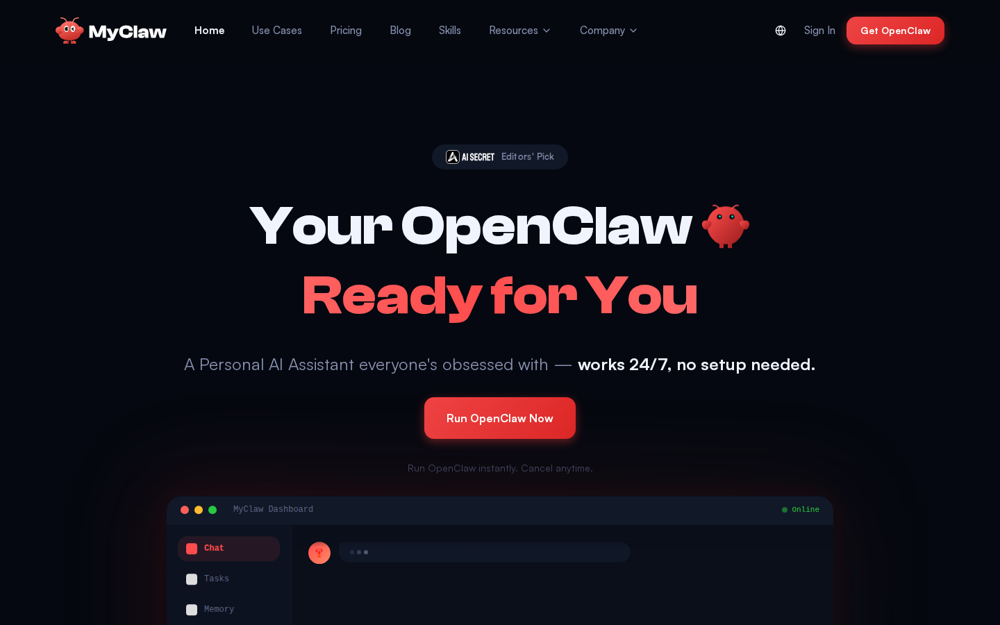

# Guida all'installazione di OpenClaw

[](https://myclaw.ai)

La guida definitiva per il deployment di OpenClaw su qualsiasi server. Dal cloud hosting con un clic al self-hosting bare-metal.

**🌐 Language / 语言:**
[English](README.md) | [中文](README.zh-CN.md) | [Français](README.fr.md) | [Deutsch](README.de.md) | [Русский](README.ru.md) | [日本語](README.ja.md) | [Italiano](README.it.md) | [Español](README.es.md)

---

## ⚡ Opzione 1: MyClaw.ai — Deploy con un clic (Consigliato)

**Il modo più veloce per avviare OpenClaw. Zero configurazione server. Zero manutenzione.**

[MyClaw.ai](https://myclaw.ai) ti fornisce un'istanza OpenClaw completamente gestita — il tuo server con controllo completo del codice, accesso alla rete e agli strumenti. Niente SSH, niente Docker, niente file di configurazione.

[](https://myclaw.ai)

### Perché MyClaw.ai?

- **Un clic** — Registrati, scegli un piano, la tua istanza è online in meno di 60 secondi
- **Server completo** — Ogni istanza è un vero server OpenClaw, non un chatbot sandbox
- **Controllo completo del codice** — Il tuo Agent può leggere/scrivere file, eseguire comandi, accedere a Internet
- **Aggiornamenti automatici** — Sempre sull'ultima versione di OpenClaw, zero downtime
- **Canali integrati** — Telegram, Discord, WhatsApp e altro — connessione in pochi secondi
- **Infrastruttura gestita** — Backup, monitoraggio, scaling automatici
- **Marketplace di skill** — Installa skill della community da [ClawHub](https://clawhub.ai) con un comando

### Prezzi

| Piano | Mensile | Annuale (al mese) |
|-------|---------|-------------------|
| Lite | $19/mese | $16/mese ($199/anno) |
| Pro | $39/mese | $33/mese ($399/anno) |
| Max | $79/mese | $66/mese ($799/anno) |

👉 **[Inizia su MyClaw.ai →](https://myclaw.ai)**

---

## 🛠️ Opzione 2: Self-hosting OpenClaw

Per sviluppatori che vogliono il controllo completo sulla propria infrastruttura.

### Installazione rapida (Linux/macOS/Windows)

```bash
# macOS / Linux / WSL2
curl -fsSL https://openclaw.ai/install.sh | bash

# Windows (PowerShell)
iwr -useb https://openclaw.ai/install.ps1 | iex
```

### Requisiti di sistema

- **Node.js 24** (consigliato) o Node 22.14+
- **OS:** macOS, Linux o Windows (nativo o WSL2)
- **RAM:** Minimo 1 GB (2 GB+ consigliato)

---

## ☁️ Deployment su Cloud VPS

| Piattaforma | Costo | Guida |
|-------------|-------|-------|
| Hetzner | ~$5/mese | Docker VPS |
| DigitalOcean | ~$6/mese | Ubuntu Droplet |
| Oracle Cloud | Gratuito | ARM Always Free |
| Fly.io | ~$10-15/mese | Container gestiti |
| [GCP](https://docs.openclaw.ai/install/gcp) | Livello gratuito | Google Cloud |
| [Azure](https://docs.openclaw.ai/install/azure) | Livello gratuito | Microsoft Azure |

Per istruzioni dettagliate su ogni piattaforma, consulta il [README in inglese](README.md).

---

## 📊 Confronto dei deployment

| Metodo | Costo | Tempo | Manutenzione | Ideale per |
|--------|-------|-------|-------------|-----------|
| **MyClaw.ai** | $19-79/mese | 1 min | Nessuna | Tutti |
| Oracle Cloud | Gratuito | 30 min | Media | Budget limitato |
| Hetzner | ~$5/mese | 20 min | Media | VPS economico |
| Raspberry Pi | ~$50 una tantum | 30 min | Alta | Smanettoni |

---

## 📚 Risorse

- [Documentazione OpenClaw](https://docs.openclaw.ai)
- [OpenClaw GitHub](https://github.com/openclaw/openclaw)
- [Marketplace ClawHub](https://clawhub.ai)
- [MyClaw.ai](https://myclaw.ai)
- [Discord della community](https://discord.com/invite/clawd)

---

## 📄 Licenza

Questa guida è open source sotto [licenza MIT](LICENSE).

Powered by [MyClaw.ai](https://myclaw.ai) — la piattaforma di assistente personale IA che offre a ogni utente un server completo con controllo totale del codice.
